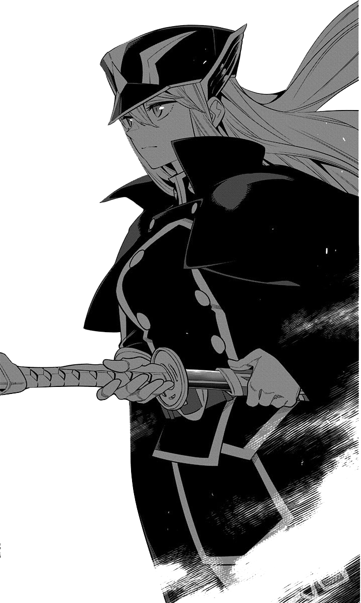

# Stm32 Balance Car
>基于FreeRTOS & stm32的平衡车   

## 硬件资料
- [原理图](https://github.com/KatagiriNanase/STM32_Balance_Car/blob/main/PCB/SCH_Schematic1_Balace_Car.pdf)
- [Gerber](https://github.com/KatagiriNanase/STM32_Balance_Car/blob/main/PCB/Gerber_PCB.zip)
- [立创工程文件](https://github.com/KatagiriNanase/STM32_Balance_Car/blob/main/PCB/ProPrj_STM32_Balance_Car.epro)
***

## 软件资料
#### **1. 外设层（Int）**
- [Tb6612电机驱动芯片](https://github.com/KatagiriNanase/STM32_Balance_Car/blob/main/Core/Int/Int_TB6612/Int_TB6612.c)
- [MPU6050陀螺仪](https://github.com/KatagiriNanase/STM32_Balance_Car/blob/main/Core/Int/Int_MPU6050/Int_MPU6050.c)
- [电机编码器](https://github.com/KatagiriNanase/STM32_Balance_Car/blob/main/Core/Int/Int_Encoder/Int_Encoder.c)
- [OLED](https://github.com/KatagiriNanase/STM32_Balance_Car/blob/main/Core/Int/OLED/OLED.c)
- [HC05蓝牙](https://github.com/KatagiriNanase/STM32_Balance_Car/blob/main/Core/Int/Int_HC05/Int_HC05.c)

#### **2. 通用层（Com）**
- [karman_Filter](https://github.com/KatagiriNanase/STM32_Balance_Car/blob/main/Core/Com/Com_Filter/Com_Filter.c)
- [PID](https://github.com/KatagiriNanase/STM32_Balance_Car/blob/main/Core/Com/PID/Com_PID.c)

#### **3. 应用层 （App）**
- [平衡车应用](https://github.com/KatagiriNanase/STM32_Balance_Car/blob/main/Core/App/App_Car.c)
- [FreeRTOS](https://github.com/KatagiriNanase/STM32_Balance_Car/blob/main/Core/App/App_Task.c)
